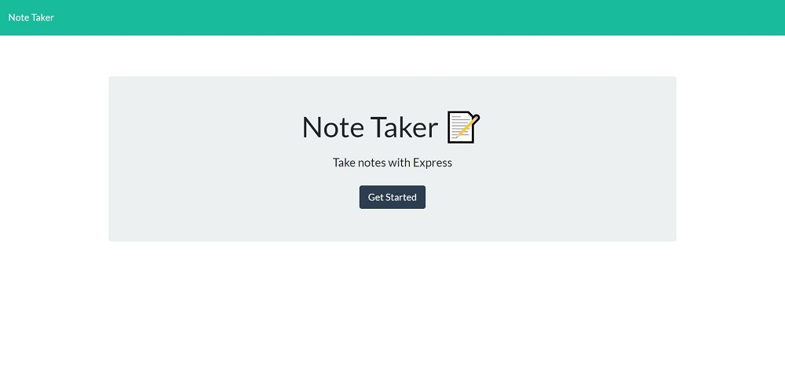

# react-portfolio

   

## Description
Designed a professional personal portfolio using React.

## Table Of Contents
* [Links](#links)

* [Installation](#installation)

* [Instructions](#instructions)

* [Screenshots](#screenshots)

* [License](#license)

## Links
[Git Repo](https://github.com/asantercureton/react-portfolio)

[Heroku Link](https://react-portfolio-10232021.herokuapp.com/)

## Installation
Run npm install.

## Instructions
Run npm start to intiate React portfolio display in the browser.

## Screenshots
Below is a screenshot of the project:

<!--  -->

<!--  -->

## License

---
© 2021 React Portfolio.