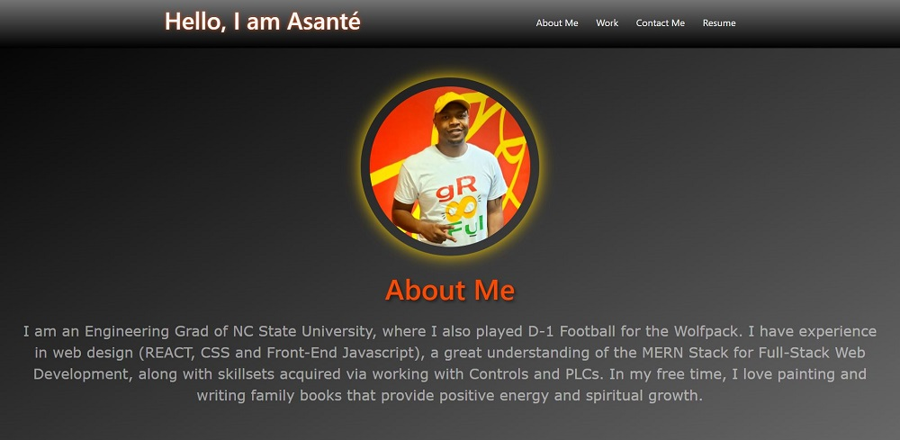
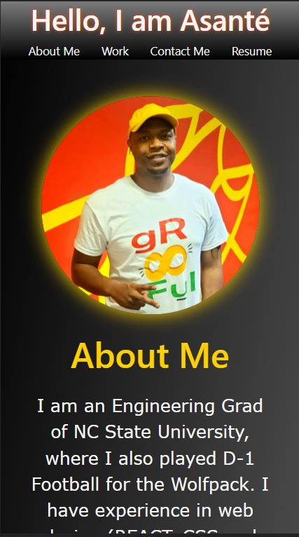

# react-portfolio

   

## Description
Designed a professional web portfolio using REACT.

## Table Of Contents
* [Links](#links)

* [Installation](#installation)

* [Instructions](#instructions)

* [Screenshots](#screenshots)

* [License](#license)

## Links
[Git Repo](https://github.com/asantercureton/react-portfolio)

[Heroku Link](https://frightful-ghoul-36931.herokuapp.com/)

## Installation
Run npm install at root directory.

## Instructions
Run npm start to intiate the REACT portfolio application.

## Screenshots
Below is a screenshot of the project:

## License

---
© 2021 Professional REACT Portfolio.